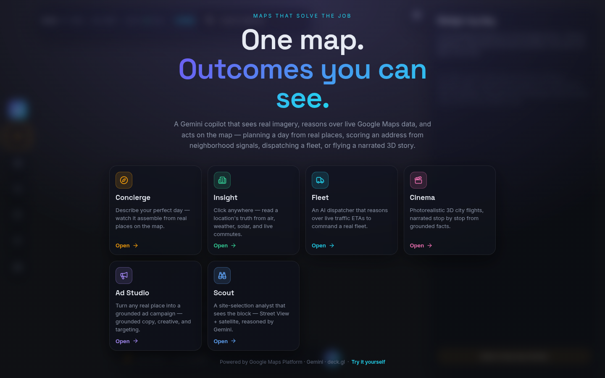

# Atlas — a real-world reasoning agent

[](LICENSE)
[](package.json)

> **A personal project by [Ryan Baumann](https://github.com/ryanbaumann).** Atlas is not an official Google product and is not affiliated with, sponsored, or endorsed by Google. It is an independent demo built on the public [Google Maps Platform](https://developers.google.com/maps) and [Gemini API](https://ai.google.dev/gemini-api/docs) — bring your own API keys, and you are responsible for your own usage and billing.

The canonical source now lives in
[ryanbaumann/fieldwork](https://github.com/ryanbaumann/fieldwork/tree/main/demos/real-world-reasoning-agent).
Fieldwork serves the production build at `/real-world-reasoning-agent/`. See
[PROVENANCE.md](PROVENANCE.md) for the pinned source snapshot and migration
boundary.

Atlas gives an AI eyes on the real world. It's a Vite + React demo of one agent that **perceives** (Street View + satellite imagery), **reasons** over grounded signals (routes, air, weather, visible street activity, solar), and **acts** — rendering its results as **interactive generative UI**. Atlas 2.0 leads with one mission that observes, compares, asks for approval, creates a campaign, and reveals the result in 3D. The six original journeys remain available as recipes. One reusable agent loop coordinates purpose-built tools, policies, typed state, and generated surfaces.

<!-- TODO(demo-gif): record a short capture of the Scout mission (brief → compare → approve → 3D reveal),
     save it as docs/screens/demo.gif (keep it under ~10 MB so it autoplays on GitHub),
     then replace this comment block with:

-->



## Journeys

| Journey | What it does |
|---|---|
| **Concierge** | One sentence in — a walkable day out. Real places, real hours, reasoned into order and drawn on the map. |
| **Insight** | Click any block. The agent pulls air, weather, solar, and live commutes — and hands down a verdict with receipts. |
| **Fleet** | A dispatcher that watches live traffic and weighs every tradeoff before it commits a single van. |
| **Cinema** | The agent flies a photoreal 3D city and narrates it — speaking only facts it can prove. |
| **Ad Studio** | Point at a storefront. Get back a campaign: grounded copy, conditioned creatives, walk-time targeting. |
| **Scout** | It walks the block on Street View, reads frontage and visible street activity, then defends its site pick with evidence. |

## Why this matters for developers

- **Visible reasoning traces.** Every answer is built from live tool calls surfaced as status chips and a progress panel — you watch the agent perceive and act, not just read a final blob of text.
- **3D as the reasoning payoff.** Cinema flies a photorealistic 3D city and narrates only what it can ground, turning the map itself into the agent's evidence.
- **Replay links.** Any completed run yields a one-click link that re-opens Atlas in the same journey + city and re-runs the prompt live — so sharing a result means sharing the *agent reasoning*, not a screenshot. Click **How it's built** in any journey to see the exact prompt and tools behind it.

## Generative UI (A2UI)

Every journey's copilot can render interactive surfaces in the chat dock (place carousels, choice chips, stat grids, image cards, camera buttons) instead of only text. Atlas speaks the [Maps Agentic UI Toolkit](https://github.com/googlemaps/a2ui) **A2UI v0.9** protocol via a `render_surface` tool and renders it with a native React catalog; wire compatibility is validated against the official `@a2ui/web_core` schemas in CI. See **[docs/GENUI.md](docs/GENUI.md)**.

## Voice input

Tap the microphone in the copilot composer to **speak your request** instead of typing. Audio is transcribed by the low-latency task-agent model (`gemini-3.5-flash-lite` by default, override with `VITE_GEMINI_STT_MODEL`) running with **MINIMAL thinking** for the fastest turnaround, and the transcript drops into the input box for you to review before sending. Recording starts only on an explicit tap, audio is sent once through the same-origin `/ai` proxy, and the mic is released as soon as you stop. Real-time bidirectional voice via the Gemini [Live API](https://ai.google.dev/gemini-api/docs/live-api) is tracked in [docs/FUTURE_WORK.md](docs/FUTURE_WORK.md).

## Architecture

```text
Browser
  ├─ Maps JavaScript SDK with VITE_GMP_API_KEY (restricted browser key)
  ├─ A2UI surfaces ← render_surface tool ← Gemini copilot
  ├─ /api/real-world-reasoning-agent/gmp/* → Fieldwork gateway → Google Maps Platform REST/static APIs
  └─ /api/real-world-reasoning-agent/ai/*  → Fieldwork gateway → Gemini API (model-allowlisted)
```

Only the restricted browser Maps key is bundled into the app. Server-side Google Maps Platform REST calls and all Gemini calls are proxied by `server/index.mjs`, which allowlists every target model. Gemini uses the hosted `GEMINI_KEY` by default. A user may instead connect a personal Gemini key from the cold open or the **AI key** control; it stays in tab memory, travels in a private same-origin header, overrides hosted access for that tab, and is never stored in URLs, browser storage, chat, or diagnostics.

### Model configuration

Atlas uses `gemini-3.6-flash` at medium thinking as the orchestration model. Bounded task agents use `gemini-3.5-flash-lite`: minimal thinking for formatting, suggestions, and voice; medium thinking for multimodal evidence analysis. Image, TTS, and optional video keep their purpose-built models. Model IDs remain overridable through the environment variables documented below.

### Bring your own Gemini key

Open **Connect Gemini** on the first screen (or **AI key** in the app header), paste a key from [Google AI Studio](https://aistudio.google.com/apikey), and choose **Test and connect**. Atlas verifies access to both the orchestrator and task-agent models without generating content. The key lasts only for the current tab and can be disconnected immediately; reloading clears it. Requests still pass through Atlas's guarded same-origin proxy, so use a deployment you trust. Your Gemini usage and billing apply to your key.

## Local development

Prerequisites: Node.js 20.19+ and a Google Cloud project with the Maps JavaScript, Places (New), Routes, Map Tiles, Geocoding, Air Quality, Weather, Pollen, Solar, Static Maps/Street View, and Maps Grounding Lite APIs enabled ([create API keys](https://console.cloud.google.com/google/maps-apis/credentials)), plus a [Gemini API key](https://aistudio.google.com/apikey).

1. Create an ignored `.env` file and set:
   - `VITE_GMP_API_KEY` — restricted browser key for Maps JavaScript, Places (New), Routes, and Map Tiles.
   - `VITE_GMP_MAP_ID` — optional public map ID; Atlas uses Google's `DEMO_MAP_ID` when unset.
   - `GMP_SERVER_KEY` — server-side Google Maps Platform REST/static key.
   - `GROUNDING_LITE_ENABLED=true` — explicit live-explorer opt-in after Grounding Lite enablement and key restrictions are verified.
   - `GEMINI_KEY` — server-side Gemini key.

2. Install and run:

   ```bash
   npm ci
   npm run dev
   ```

Vite keeps development equivalents for `/api/real-world-reasoning-agent/capabilities`, `/api/real-world-reasoning-agent/gmp/*`, and `/api/real-world-reasoning-agent/ai/*`, so local development does not require a separate server process.

## Fieldwork production integration

Build the workspace package from this directory:

```bash
npm run build
```

Fieldwork's root build stages `dist/` at `/real-world-reasoning-agent/`. The
snapshot's bounded server modules remain under `server/` as migration input for
the shared gateway. They are not a second production server inside the
Fieldwork container. `npm run preview` builds the package and starts the shared
Fieldwork gateway from the repository root.

## Tests

`npm run test:unit` runs the vitest suite (A2UI protocol/store, schema parity against `@a2ui/web_core`, the Ad Studio prompt builder + targeting-ring math, and Scout score fusion / vision JSON parsing). `npm test` runs typecheck, unit tests, and the source-integrity unit tests. Fieldwork CI discovers and builds this package through `apps.json`.

## Smoke test

`npm run smoke` drives each journey in a headless browser and asserts the map canvas paints. It needs a running preview server and a Chromium binary:

```bash
npm run preview &                     # serves the built app on :8080
ALLOW_LIVE_MAPS_BROWSER=1 CHROMIUM_PATH=/path/to/chromium npm run smoke
```

Override the target with `SMOKE_URL` (defaults to `http://localhost:8080`). Screenshots are written to `/tmp/atlas-journey-smoke` unless `SMOKE_OUT` is set. The explicit `ALLOW_LIVE_MAPS_BROWSER=1` acknowledgement is required because the smoke mounts the configured Maps JavaScript renderer and may incur Google Maps Platform costs.

## Security notes

Keep `GMP_SERVER_KEY` and hosted `GEMINI_KEY` server-side only (`.env` locally, the Fieldwork gateway in production) — never commit them. A user-entered Gemini key is deliberately tab-scoped and never persisted, but any same-origin JavaScript can access in-memory credentials; use BYOK only on a deployment you trust. Restrict `VITE_GMP_API_KEY` by HTTP referrer and to the specific Maps APIs it needs, since it ships in the client bundle. See [SECURITY.md](SECURITY.md) for reporting and key-handling expectations.

## Contributing & license

Contributions are welcome — see [CONTRIBUTING.md](CONTRIBUTING.md) for the lightweight workflow. Released under the [MIT License](LICENSE).

Atlas is maintained by [Ryan Baumann](https://github.com/ryanbaumann) as a personal project. If it helped you build something with maps + agents, a ⭐ helps others find it.
