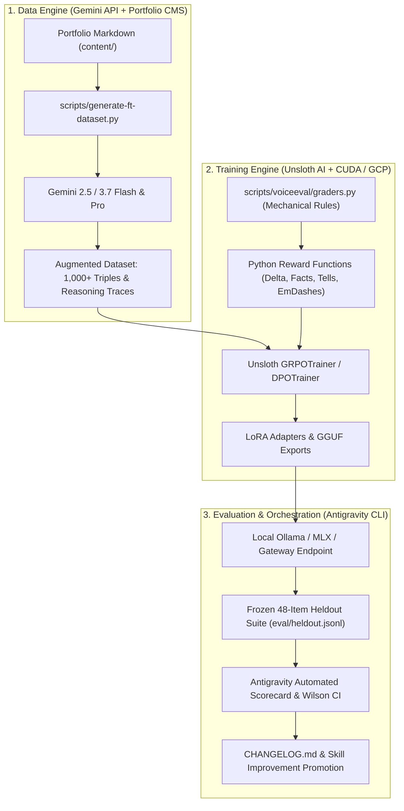

# Deep Dive Research & Architecture: Unsloth + Gemini + Antigravity for Voice Fine-Tuning

**Author:** Ryan Baumann  
**Date:** August 17, 2026  
**Repository:** `ryanbaumann/fieldwork` (`experiment/voice-ft/`)  
**Context:** Evaluating Unsloth AI as a next-generation fine-tuning engine alongside Gemini and Antigravity, compared against Apple Silicon Metal (`mlx_lm.lora`).

---

## 1. Executive Summary

In Rounds 1–6 of `experiment/voice-ft`, we demonstrated that open-weight models (Gemma 4 26B-A4B MoE and Gemma 4 31B Dense) can be adapted to Ryan Baumann's authentic engineering voice via 4-bit QLoRA on Apple Silicon (M4 Pro 48GB). 

While **Gemma 4 31B Dense** achieved a **35% clean pass rate** (17/48 items, 100% fact retention, zero repetition loops), pure Supervised Fine-Tuning (SFT) on 245 micro-pairs is hitting an empirical ceiling on complex negative constraints (e.g., verbatim echoes, em-dash avoidance, restraint on light edits, and subtle tone calibration).

**Unsloth AI** introduces two transformative capabilities that address these exact bottlenecks:
1. **Extreme Efficiency & Speed**: 2–5x faster training throughput and 70–80% VRAM reduction via custom fused Triton kernels and manual backpropagation derivation.
2. **Reinforcement Learning with Rule-Based GRPO (Group Relative Policy Optimization)**: Unsloth makes DeepSeek-R1-style GRPO accessible on single GPUs without requiring a separate critic/reward model. **Our 16+ deterministic Python graders from `scripts/voiceeval/graders.py` can be plugged directly into Unsloth as live in-training reward functions**, forcing the policy to directly optimize against `G-EDIT-DELTA`, `G-FACT-KEEP`, `G-EMDASH`, `G-ECHO`, and `G-AI-TELLS`.

---

## 2. Comparative Analysis: Unsloth vs. Apple Silicon MLX (`experiment/voice-ft`)

| Architectural Dimension | What We Did: Apple Silicon MLX (`mlx_lm.lora`) | Proposed: Unsloth AI (`unsloth`) | Strategic Advantage |
|---|---|---|---|
| **Hardware Backend** | Native Apple Silicon Metal (unified memory, M4 Pro 48GB). | NVIDIA CUDA GPUs (T4, L4, A100, H100, RTX 3090/4090). | **Unsloth**: Scalable to cloud spot GPUs (GCP Vertex AI / GCE L4 in `geojson-bq-blog`). |
| **Training Algorithms** | Supervised Fine-Tuning (SFT / QLoRA) only. | SFT, DPO, ORPO, KTO, and **GRPO** (Group Relative Policy Optimization). | **Unsloth**: Direct policy optimization via reinforcement learning. |
| **In-Training Reward Signals** | Passive cross-entropy loss with `--mask-prompt`. | Dynamic multi-objective Python reward functions evaluated across rollout groups. | **Unsloth**: Direct mathematical optimization against our mechanical checks. |
| **Kernel Optimization** | Apple Metal compute graph, dynamic compilation in MLX. | Custom fused Triton kernels (RoPE, Cross-Entropy, RMSNorm, LoRA backprop). | **Unsloth**: 2–5x step speedup; 70–80% lower memory footprint per token. |
| **Memory & Concurrency** | Shared unified memory; strict zero-concurrency rule (concurrency causes kernel stalls/crashes). | Dedicated VRAM management; gradient checkpointing + 4-bit QLoRA fits 27B–32B on 24GB–40GB VRAM. | **Unsloth**: Enables parallel batch rollouts for GRPO without host memory crashes. |
| **Base Model Support** | Gemma 4 26B/31B (MLX community 4-bit quants). | Gemma 2/3/4, Llama 3/3.1/3.3, Qwen 2.5, DeepSeek-R1 distills, Mistral, multimodal. | **Unsloth**: Broader model family exploration and unsloth dynamic 4-bit quants. |
| **Export & Deployment** | MLX `.safetensors` adapters (locked to Apple Silicon MLX runtime). | Native Hugging Face LoRA, 16-bit merged weights, **GGUF (Q4_K_M, Q8_0)**, and vLLM. | **Unsloth**: GGUF export runs anywhere (Ollama, llama.cpp, Cloud Run, vLLM). |
| **Operating Cost** | $0 (local Mac compute), but ties up workstation during runs. | Low cost ($0.20–$0.80 per run on GCP spot L4/A100 or free on Colab T4/A100). | **Balanced**: Local Mac for fast inference; Cloud Unsloth for heavy RL/GRPO runs. |

---

## 3. The Triad Architecture: Gemini + Antigravity + Unsloth

Integrating Gemini API and Antigravity with Unsloth creates an autonomous, self-improving fine-tuning loop:



### 3.1 Role of Gemini (Synthetic Data & Distillation Engine)
- **High-Throughput Transformation**: Generate 500+ diverse corruption variants (passive corporate, hype, academic, messy dictation, buzzword soup) from `portfolio/content/`.
- **Preference Pair Generation (`chosen` vs `rejected`)**: Have Gemini 3.7 Pro produce intentional failure cases (e.g. violating em-dash rules or inserting hype phrases) paired with authentic Ryan voice rewrites for DPO/ORPO training.
- **Chain-of-Thought (CoT) Rationale Mining**: Generate explicit reasoning traces (`<reasoning> ... </reasoning>`) explaining *why* an edit was made, training models to think before rewriting.

### 3.2 Role of Unsloth (Accelerated Training Core)
- **Rule-Based GRPO**: Generate $G$ completions per prompt (e.g., $G=4$ or $G=8$) and evaluate them with our exact Python graders. The group advantage calculation rewards outputs that achieve high edit deltas, retain 100% of facts, and produce zero lexical tells.
- **Low Memory Overhead**: Run GRPO with vLLM generation backend on a single L4 (24GB) or A100 (40GB/80GB) GPU.
- **Direct GGUF Export**: Export directly to `gemma-4-ryan-voice.gguf` for sub-second local inference in Ollama.

### 3.3 Role of Antigravity (Agentic Orchestrator & Verifier)
- **One-Turn Orchestration**: Manages the end-to-end pipeline (dataset generation -> GCP job submission -> adapter fetch -> local evaluation).
- **Separation of Author and Verifier**: The fine-tuned model never grades itself. Antigravity executes the held-out evaluation harness (`npm run eval:grade`, `npm run eval:leakage`, `test:voice`) and computes Wilson score intervals.
- **Durable Memory & Skills**: Formulates learnings into `.agents/skills/portfolio-writing/SKILL.md` and repo changelogs.

---

## 4. Transforming `graders.py` into Unsloth GRPO Reward Functions

The breakthrough with Unsloth GRPO is converting our post-hoc evaluation suite into real-time reinforcement learning rewards.

### Complete Reward Function Implementation Blueprint:

```python
"""
Unsloth GRPO Custom Reward Functions for Ryan Voice Fine-Tuning.
Adapts checks from `scripts/voiceeval/graders.py` into vectorized reward signals.
"""

import re
from typing import List, Dict, Any

# 1. Em-Dash Penalty (G-EMDASH)
def emdash_reward_func(completions: List[List[Dict[str, str]]], **kwargs) -> List[float]:
    """Strictly penalize em-dashes (\u2014 or \u2013 or --)."""
    emdash_pattern = re.compile(r"[\u2014\u2013]|--")
    rewards = []
    for comp in completions:
        text = comp[0]["content"]
        hits = len(emdash_pattern.findall(text))
        # Reward 1.0 if clean, -1.5 per em-dash violation
        rewards.append(1.0 if hits == 0 else -1.5 * hits)
    return rewards

# 2. Lexical Tells & Banned Hype Words (G-AI-TELLS, G-HYPE)
def lexical_tells_reward_func(completions: List[List[Dict[str, str]]], **kwargs) -> List[float]:
    """Penalize AI tells and corporate buzzwords from voice-lexicon.json."""
    BANNED_TELLS = [
        r"\bdelve\b", r"\btapestry\b", r"\btestament\b", r"\bleverage\b",
        r"\bthrilled to announce\b", r"\bpleased to announce\b",
        r"\bparadigm shift\b", r"\bgame-changer\b", r"\brobust\b",
        r"\bseamlessly\b", r"\bholistic\b", r"\bcutting-edge\b"
    ]
    pattern = re.compile("|".join(BANNED_TELLS), re.IGNORECASE)
    rewards = []
    for comp in completions:
        text = comp[0]["content"]
        matches = len(pattern.findall(text))
        rewards.append(1.0 if matches == 0 else -2.0 * matches)
    return rewards

# 3. Fact Retention & Entity Preservation (G-FACT-KEEP)
def fact_preservation_reward_func(
    completions: List[List[Dict[str, str]]],
    must_preserve: List[List[str]],
    **kwargs
) -> List[float]:
    """Reward keeping all specified metrics, numbers, and proper nouns."""
    rewards = []
    for comp, req_facts in zip(completions, must_preserve):
        text = comp[0]["content"]
        if not req_facts:
            rewards.append(0.5)
            continue
        missing = [fact for fact in req_facts if not re.search(r"(?<!\w)" + re.escape(fact) + r"(?!\w)", text, re.IGNORECASE)]
        if not missing:
            rewards.append(2.0)  # Full reward for 100% fact retention
        else:
            rewards.append(-1.0 * len(missing))
    return rewards

# 4. Edit Delta & Meaningful Transformation (G-EDIT-DELTA & G-ECHO)
def edit_transformation_reward_func(
    completions: List[List[Dict[str, str]]],
    source_text: List[str],
    **kwargs
) -> List[float]:
    """Ensure the model actually edits the text without regurgitating verbatim inputs."""
    rewards = []
    for comp, src in zip(completions, source_text):
        out = comp[0]["content"].strip()
        if not src:
            rewards.append(0.0)
            continue
        
        src_tokens = set(re.findall(r"\w+", src.lower()))
        out_tokens = set(re.findall(r"\w+", out.lower()))
        
        if not src_tokens:
            rewards.append(0.0)
            continue
            
        jaccard = len(src_tokens & out_tokens) / float(len(src_tokens | out_tokens))
        
        # Perfect edit zone: 20% - 65% token overlap (meaning preserved, structure rewritten)
        if 0.20 <= jaccard <= 0.65:
            rewards.append(2.0)
        elif jaccard > 0.85:
            rewards.append(-3.0)  # Severe penalty for verbatim echo / no edit
        else:
            rewards.append(0.5)
    return rewards

# 5. Citation Validity (G-CITATION)
def citation_validity_reward_func(completions: List[List[Dict[str, str]]], **kwargs) -> List[float]:
    """Penalize malformed or obviously fabricated arXiv / DOI links."""
    arxiv_pattern = re.compile(r"arxiv\.org/abs/(\d{4}\.\d{4,5})", re.IGNORECASE)
    malformed_arxiv = re.compile(r"arxiv\.org/abs/([a-z0-9\.\-]+)", re.IGNORECASE)
    rewards = []
    for comp in completions:
        text = comp[0]["content"]
        all_links = malformed_arxiv.findall(text)
        if not all_links:
            rewards.append(0.2)
            continue
        valid_links = arxiv_pattern.findall(text)
        # Check valid months (01-12)
        properly_formed = [l for l in valid_links if 1 <= int(l[2:4]) <= 12]
        if len(properly_formed) == len(all_links):
            rewards.append(1.5)
        else:
            rewards.append(-3.0)  # Fabricated citation penalty
    return rewards
```

---

## 5. End-to-End Implementation Workflow: Round 7

### Phase 1: Synthetic Data Augmentation (Gemini API)
- Expand dataset from 245 micro-pairs to 1,000+ examples across the 5 core tasks.
- Generate negative preference pairs (`prompt`, `chosen`, `rejected`) using Gemini 3.7 Pro.
- Store output in `experiment/voice-ft/training/dpo_pairs.jsonl` and `grpo_prompts.jsonl`.

### Phase 2: Unsloth GRPO / DPO Execution (Cloud GPU / GCP Spot)
- Provision an ephemeral L4 (24GB) or A100 (40GB) spot instance on Google Cloud (`geojson-bq-blog` via Vertex AI Custom Training or GCE Deep Learning VM).
- Execute `train_unsloth_grpo.py` with the reward functions defined above.
- Training duration: ~20–35 minutes (cost: < $0.60 on spot pricing).
- Export adapter weights to `adapters/gemma-4-ryan-voice-v7/` and export GGUF format `models/gemma-4-ryan-voice-v7.Q8_0.gguf`.

### Phase 3: Verification & Integration (Antigravity)
- Run the frozen 48-item held-out evaluation suite:
  ```bash
  python3 scripts/voice_eval.py run --adapter ./adapters/gemma-4-ryan-voice-v7 --label r7
  npm run eval:grade -- --results experiment/voice-ft/eval/results/r7_results.json
  npm run eval:leakage
  ```
- Compare head-to-head against Round 6 Dense 31B and MoE 26B baselines.
- Update `RESEARCH_FINDINGS.md`, `CHANGELOG.md`, and promote durable voice learnings to `.agents/skills/portfolio-writing/SKILL.md`.

---

## 6. Recommendations & Next Steps

1. **Adopt Unsloth for Round 7 Reinforcement Learning (GRPO & DPO)**:
   Use Unsloth on a cloud GPU (GCP L4 spot / Colab A100) to move from passive SFT to active policy optimization using our rule-based reward functions.
2. **Retain MLX for Local Interactive Inference on Apple Silicon**:
   Keep `scripts/local_gemma.py` and `scripts/gemma-local.sh` for fast, zero-cloud-cost daily editing and headline generation on Mac.
3. **Deploy GGUF / Ollama Support**:
   Exporting Unsloth fine-tuned models to GGUF allows running quantized models locally via Ollama or llama.cpp with sub-second time-to-first-token.
